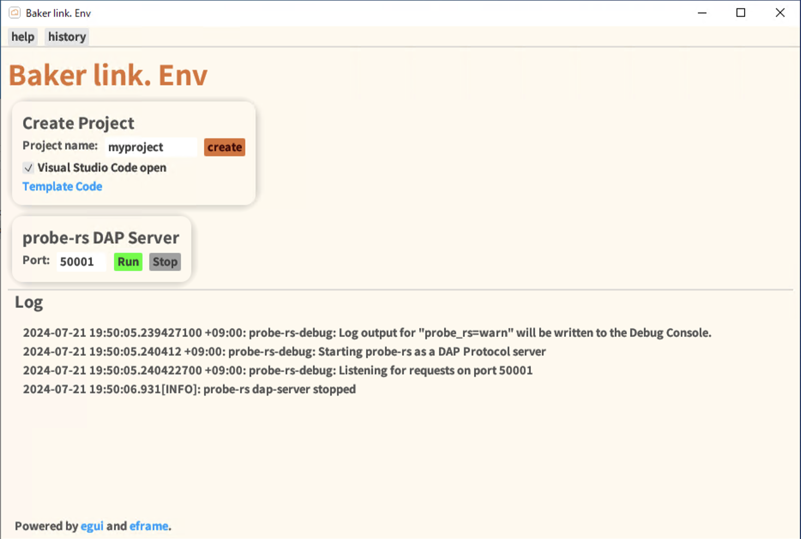

# Baker link. Env (Baker link. Dev tool)

[](https://github.com/emilk/egui)

<a href="https://www.buymeacoffee.com/Bakerlink.Lab" target="_blank"></a>

<div align="center">


Development Environment Auxiliary Tools for the Baker link. series

</div>


Portable Rust embedded development by communicating with Dev Containers (VSCode) and probe-rs DAP Server.
Baker link. Env is responsible for creating the project with embedded Dev Containers and starting probe-rs.

## Baker link. Env



### Required Tools

To use Baker link.Dev, the following tools must be installed.

- Docker ( [Rancher Desktop by SUSE](https://rancherdesktop.io/) )
- [Visual Studio Code](https://code.visualstudio.com/)
- [probe-rs](https://probe.rs/)

## Install

Compatible with both Windows and Mac.
There is an installer on the [Release](https://github.com/Baker-link-Lab/baker-link-env/releases) page.

### How to Address "Damaged" Error When Launching the App on Mac

After installing Baker link. Env, please run the following command in the terminal:

```sh
xattr -d com.apple.quarantine "/Applications/Baker link. Env.app"
```

## License

Copyright (c) 2024 Baker-Tanaka

Licensed under the [MIT](LICENSE) license.
