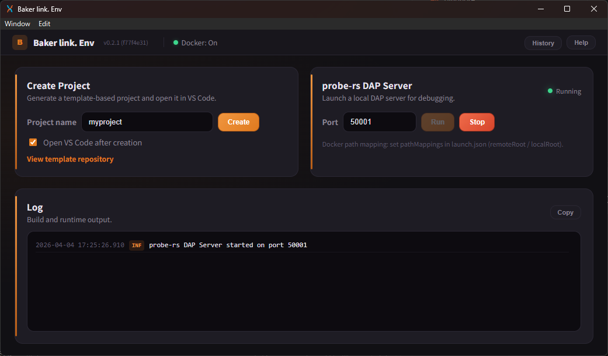
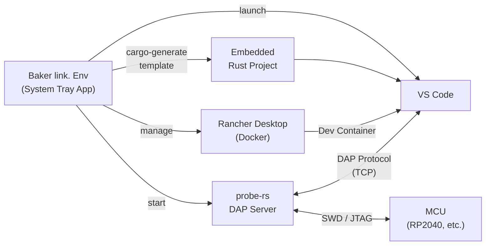

# Baker link. Env

[](https://dioxuslabs.com)
[](LICENSE)
[]()

<a href="https://www.buymeacoffee.com/Bakerlink.Lab" target="_blank"></a>

<div align="center">


**Development environment assistant for embedded Rust with Baker link. series boards**

</div>


---

## Overview

**Baker link. Env** is a desktop application that automates the setup of an embedded Rust development environment. It bridges VS Code Dev Containers (running inside Docker) with a probe-rs DAP server running on the host, allowing you to write, build, and debug embedded Rust code entirely within a container — without touching your host Rust toolchain.



---

## How It Works


```mermaid
flowchart LR
    BL["Baker link. Env\n(System Tray App)"]

    BL -->|"cargo-generate\ntemplate"| Project["Embedded\nRust Project"]
    BL -->|"launch"| VSCode["VS Code"]
    BL -->|"manage"| Docker["Rancher Desktop\n(Docker)"]
    BL -->|"start"| DAP["probe-rs\nDAP Server"]

    Project --> VSCode
    Docker -->|"Dev Container"| VSCode

    DAP <-->|"DAP Protocol\n(TCP)"| VSCode
    DAP <-->|"SWD / JTAG"| MCU["MCU\n(RP2040, etc.)"]
```

1. **Create Project** — generates a template-based embedded Rust project via `cargo-generate` and opens it in VS Code.
2. **Dev Container** — VS Code attaches to a Docker container that provides the full Rust toolchain and build environment.
3. **probe-rs DAP Server** — Baker link. Env starts a DAP server on the host that VS Code connects to over TCP for debugging.
4. **Debug** — breakpoints, step-through, and live memory inspection work seamlessly between the container and the physical MCU.

---

## Features

| Feature | Description |
|---|---|
| **Project creation** | One-click project scaffolding from a Git template via `cargo-generate` |
| **VS Code integration** | Automatically opens the new project in VS Code |
| **probe-rs DAP Server** | Start/stop a local DAP server with configurable port |
| **Docker path mapping** | Maps container paths to host paths in the DAP server for seamless debugging |
| **Docker management** | Detects Rancher Desktop status and offers to start it |
| **Project history** | Quick access to recent projects from the UI and system tray |
| **System tray** | Runs as a tray-resident app — control DAP server and open projects without opening the window |

---

## Requirements

- [Rancher Desktop](https://rancherdesktop.io/) (provides Docker)
- [Visual Studio Code](https://code.visualstudio.com/)

---

## Install

Installers for Windows and macOS are available on the [Releases](https://github.com/Baker-link-Lab/baker-link-env/releases) page.

### macOS: "Damaged App" Error

If macOS shows a "damaged" warning after installing, run:

```sh
xattr -d com.apple.quarantine "/Applications/Baker link. Env.app"
```

---

## Usage

### 1. Create a Project

1. Enter a project name in the **Create Project** panel.
2. Click **Create** and choose a parent folder.
3. The app generates the project and opens it in VS Code.

### 2. Start the DAP Server

1. Set the port (default: `50001`) in the **probe-rs DAP Server** panel.
2. Click **Run**. The server starts and listens for VS Code debugger connections.
3. In VS Code's `launch.json`, configure:

```json
{
  "type": "probe-rs-debug",
  "request": "launch",
  "server": "localhost:50001"
}
```

### 3. Docker Path Mapping (Dev Container)

When the project is compiled inside a Docker container, DWARF debug info contains container paths (e.g. `/myproject/src/main.rs`). Use `pathMappings` in `launch.json` to map them to host paths:

```json
{
  "pathMappings": [
    { "remoteRoot": "/myproject", "localRoot": "C:/Users/you/projects/myproject" }
  ]
}
```

### 4. System Tray

Baker link. Env runs in the system tray. Right-click the tray icon to:

- Start / Stop the DAP server
- Check Docker status and start Rancher Desktop
- Open a recent project in VS Code
- Show / hide the main window

---

## License

Copyright (c) 2024 Baker-Tanaka
Licensed under the [MIT](LICENSE) license.
